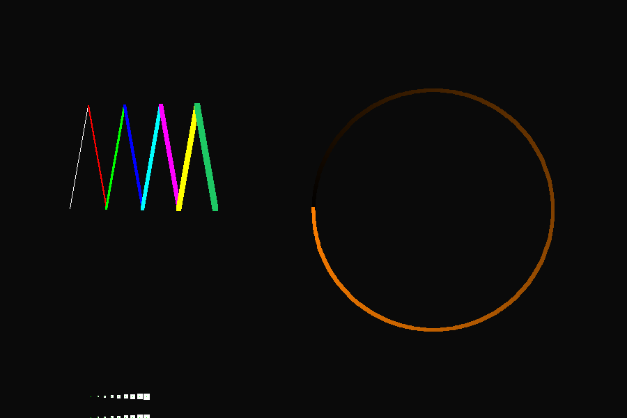
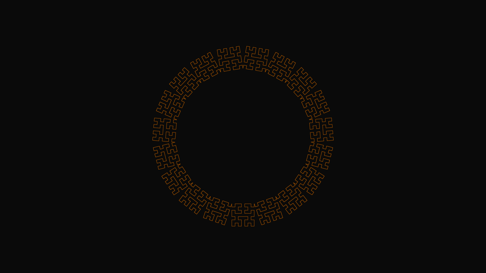
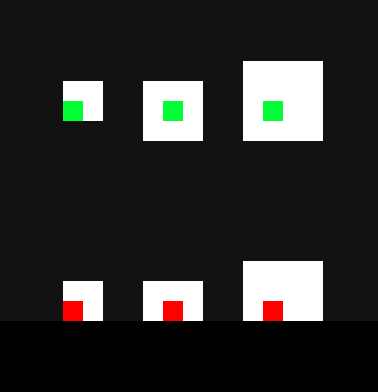

# go-turtle

[Turtle graphics](https://en.wikipedia.org/wiki/Turtle_graphics)
in Go.

A couple of small showcase scripts are in the
[samples](samples)
folder.

Moving around:



A conveniently 4K shaped image:



## Turtle

A minimal Turtle agent, moving on a cartesian plane.

The orientation is in degrees.
`Right` rotates clockwise, `Left` counter-clockwise.

Use it to simulate the movements of the turtle without the drawing overhead.

```go
// create a new turtle
t := turtle.New()

// move it just like you expect
t.Forward(5)
t.Left(45)
t.Forward(5)
t.Right(45)
t.Backward(5)

// get the X, Y, Deg data as needed
fmt.Println(t.X, t.Y, t.Deg)
// 3.5355339059327378 3.5355339059327373 0

// teleport around
t.SetPos(4, 4)
t.SetHeading(120)

// vaguely nice printing
fmt.Println("T:", t)
// T: (   4.0000,    4.0000) ^  120.0000
```

## TurtleDraw

Has the same interface of `Turtle`, but draws.
Each `TurtleDraw` is attached to a `World`.

Create a new world to draw in:
an uniform image of the requested size `(width, height)`
with `SoftBlack` background is generated.

```go
w := turtle.NewWorld(900, 600)
```

The background color can be set:

```go
w := turtle.NewWorldWithColor(900, 600, turtle.Yellow)
```

An existing image can be used as base:

```go
img := image.NewRGBA(image.Rect(0, 0, 900, 600))
draw.Draw(img, img.Bounds(), &image.Uniform{turtle.Cyan}, image.Point{0, 0}, draw.Src)
wi := turtle.NewWorldWithImage(img)
```

Create a `TurtleDraw` attached to the `World`:

```go
// create a turtle attached to w
td := turtle.NewTurtleDraw(w)

// position/orientation
td.SetPos(100, 300)
td.SetHeading(turtle.North + 80)

// line style
td.SetColor(turtle.Blue)
td.SetSize(4)

// start drawing
td.PenDown()

// same interface as Turtle
td.Forward(100)
td.Left(160)
td.Forward(100)
```

Save the current image:

```go
err := w.SaveImage("world.png")
if err != nil {
    fmt.Println("Could not save the image: ", err)
}
```

Close the world (there are two open internal channels).

```go
w.Close()

// this is an error: the turtle tries to send the line
// to the world input channel that has been closed
// td.Forward(50)
```

You can create as many turtles as you want.
The
[Hilbert](samples/hilbert/sample.go)
script shows an example where multiple turtles are created and placed,
and then are all controlled at once to generate the same pattern in different locations.
In this way,
the expensive computation to generate the Hilbert fractal instructions is only done once.

When drawing, a turtle sends the line to the world on a channel
and blocks until it is done.

## Constants

A few standard colors:

```go
Black     = color.RGBA{0, 0, 0, 255}
SoftBlack = color.RGBA{10, 10, 10, 255}
White     = color.RGBA{255, 255, 255, 255}

Red   = color.RGBA{255, 0, 0, 255}
Green = color.RGBA{0, 255, 0, 255}
Blue  = color.RGBA{0, 0, 255, 255}

Cyan    = color.RGBA{0, 255, 255, 255}
Magenta = color.RGBA{255, 0, 255, 255}
Yellow  = color.RGBA{255, 255, 0, 255}

DarkOrange = color.RGBA{150, 75, 0, 255} // It's just so warm and relaxing
```

Cardinal directions:

```go
East  = 0.0
North = 90.0
West  = 180.0
South = 270.0
```

## Implementation notes

### Note on float64

A lot of inputs to the API are actually `float64`, so when using a variable
instead of an untyped const the compiler will complain if the var is `int`.

So this works as the var has type float:

```go
segLen := 150.0
td.Forward(segLen)
```

and this does not:

```go
segLen := 150
td.Forward(segLen)
// cannot use segLen (variable of type int) as float64 value
// in argument to td.Forward (compile)
```

This works magically because in Go constants are
[neat](https://blog.golang.org/constants).

```go
td.Forward(150)
```

### Drawing pixels

When drawing points of odd size, the square is centered on the position.
When drawing points of even size, the square is shifted to the top and right.
The red points are drawn with `y=0`, along the bottom border of the image.



To draw a single point, just call forward with 0 dist:

```go
td.Forward(0)
```

### Channels and line drawing

The world draws the `Line` it receives on the `DrawLineCh` channel,
so you can technically draw a line directly with that
skipping the turtles altogether,
and everything should work.

## TODO - Ideas

- [x] Hilbert sample!
- [ ] More colors!

## Contributing

This was a side project to another one I was doing to learn Go,
so all improvements and suggestions for a better code are welcome.
